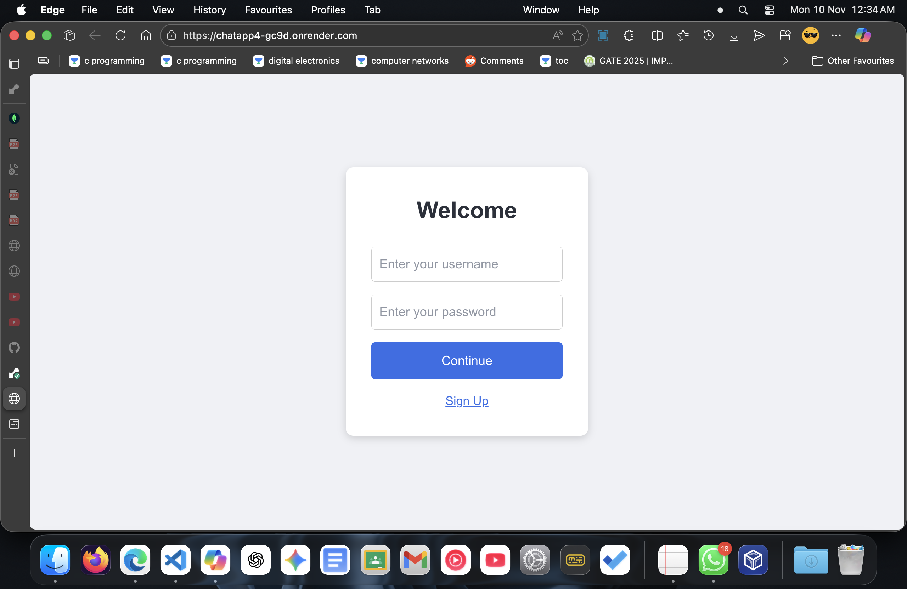
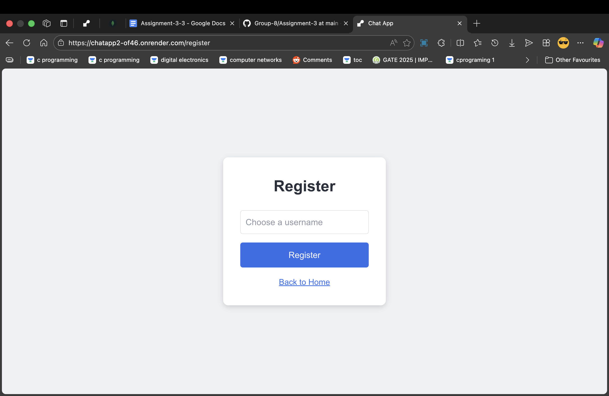
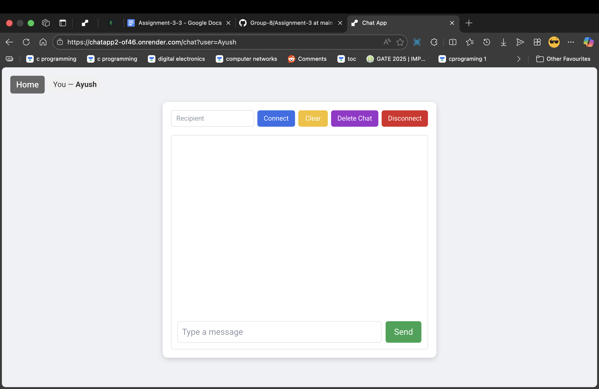
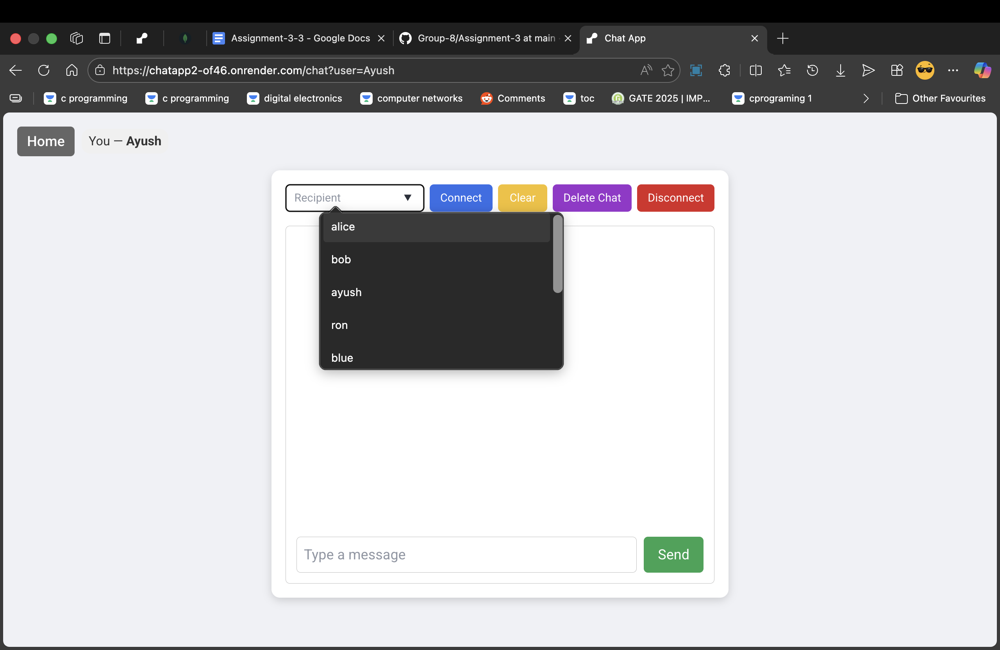
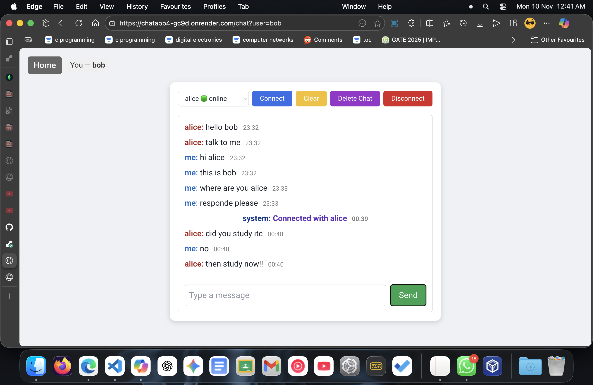
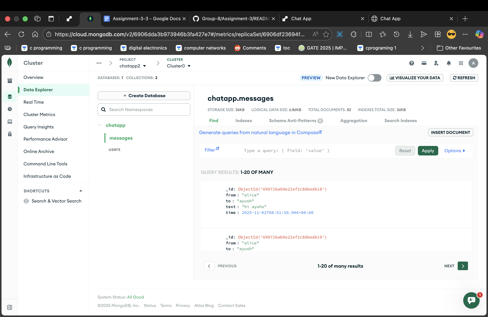

Got it — your draft is solid, it just needs proper Markdown formatting and consistent sectioning so it looks clean on GitHub. Here’s the polished version you can copy‑paste directly into your `README.md`:

---

```markdown
# Chat Application (Assignment 3)

## Project Overview
This project is a real-time chat application built using **Next.js**, **Node.js**, **Socket.IO**, and **MongoDB**.  
It allows users to:
- Register and log in with a username and password.
- View a list of registered users.
- Connect with another user and exchange private messages in real time.
- View chat history with timestamps.
- Delete chat history when needed.

The application is structured with a Next.js frontend, API routes for backend logic, a custom server with Socket.IO for real-time communication, and MongoDB for persistence.

---
```
## Live Deployment
The project is deployed on **Render** at the following URL:  
[https://chatapp2-of46.onrender.com/](https://chatapp2-of46.onrender.com/)

> Note: Since this is hosted on the free tier of Render, the server may take **30–60 seconds to “wake up”** if it has been idle. Please allow some time for the first request to load.

---
```
```
## Steps to Install and Run Locally

### 1. Clone the repository
```bash
git clone <repo-url>
cd chatapp2

```
### 2. Install dependencies
```bash
npm install
```

### 3. Create environment file
In the project root, create a file named `.env.local` with the following content:
```bash
MONGODB_URI=your-mongodb-connection-string
```
> Do not commit this file. Each user should provide their own MongoDB URI.

### 4. Run the development server
```bash
npm run dev
```

### 5. Access the app
Open [http://localhost:3000](http://localhost:3000) in your browser.

---

## Screenshots
## Screenshots

### Login Page


### Register Page


### Chat Interface
Here are four different views of the chat interface:






### MongoDB Dashboard



---

## Architecture
The project is organized into three main layers: **Frontend**, **Backend (API + Socket.IO)**, and **Database**.

```
                +-------------------+
                |     Frontend      |
                |   (Next.js App)   |
                |-------------------|
                | app/              |
                | pages/            |
                | public/           |
                +---------+---------+
                          |
                          v
                +-------------------+
                |   API Routes      |
                | (Next.js backend) |
                |-------------------|
                | /api/register     |
                | /api/login        |
                | /api/users        |
                | /api/message      |
                | /api/messages     |
                | /api/deleteMsgs   |
                +---------+---------+
                          |
                          v
                +-------------------+
                |   Socket.IO       |
                |   (server.js)     |
                |-------------------|
                | Manages user map  |
                | Routes private    |
                | messages          |
                +---------+---------+
                          |
                          v
                +-------------------+
                |   MongoDB Atlas   |
                |-------------------|
                | Database: chatapp |
                | Collections:      |
                |  - users          |
                |  - messages       |
                +-------------------+
```

---

## Technologies Used
- **Next.js** (React framework for frontend + API routes)  
- **Node.js** (runtime environment)  
- **Socket.IO** (real-time bidirectional communication)  
- **MongoDB Atlas** (cloud database)  
- **CSS** (styling)  

---

## Learning Outcomes
Through this project, I learned:
- How to integrate Socket.IO with a Next.js app for real-time communication.  
- How to design API routes in Next.js for authentication and data persistence.  
- How to use MongoDB without Mongoose, directly handling collections and documents.  
- How to structure a project with clear separation of frontend, backend, and database logic.  
- How to manage environment variables securely using `.env.local`.  
```

