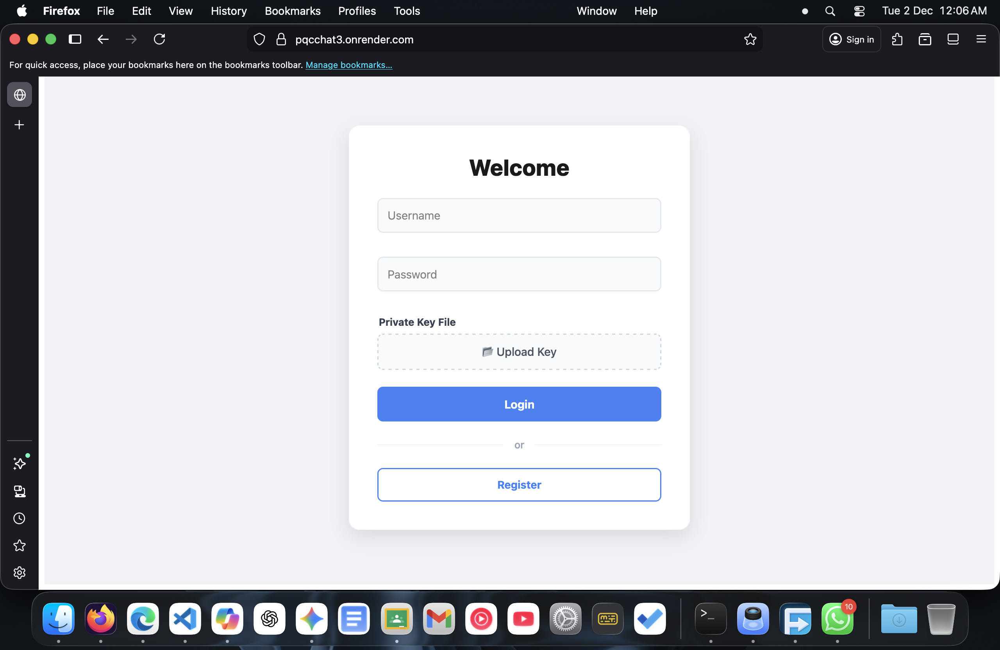
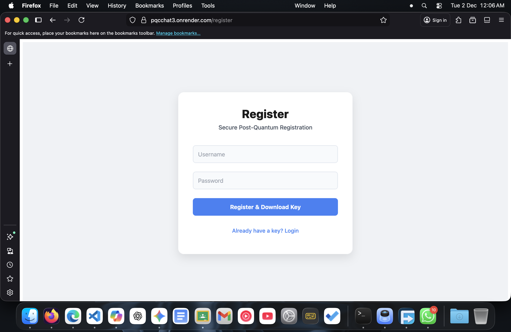
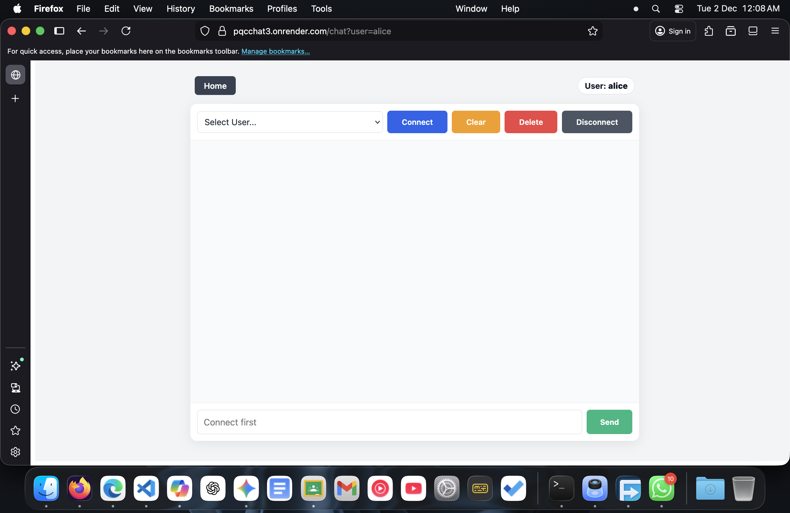
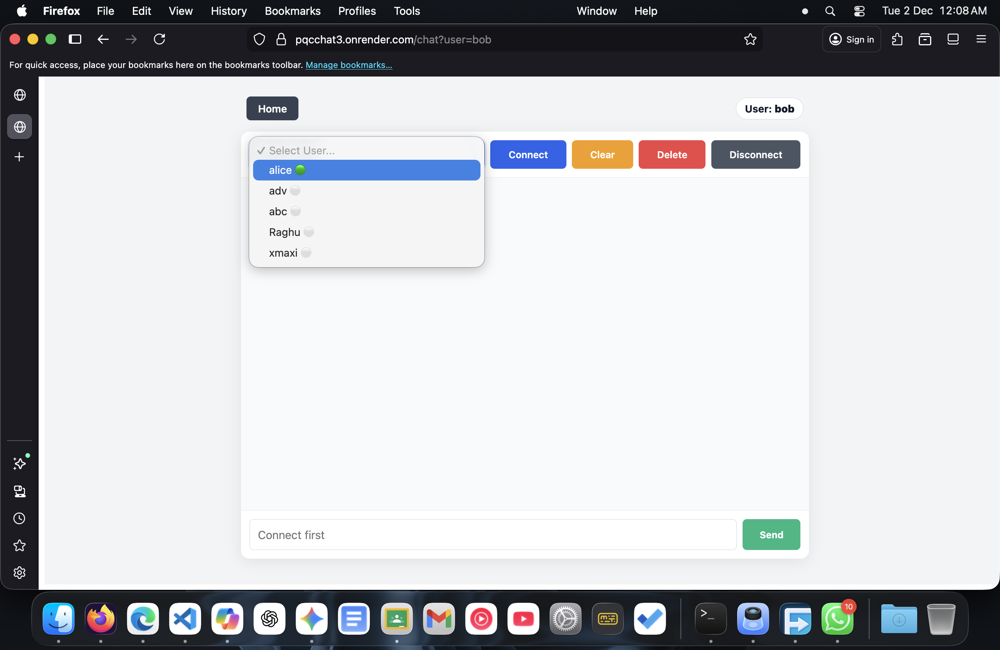
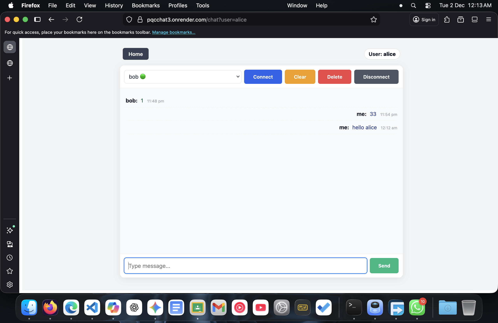

## Live Deployment
The project is deployed on **Render** at the following URL:  
[https://pqcchat3.onrender.com](https://pqcchat3.onrender.com)

> **Note:** Since this is hosted on the free tier of Render, the server may take **30–60 seconds to “wake up”** if it has been idle. Please allow some time for the first request to load.

# Post-Quantum Secure Chat Application

## Project Overview
This project is a high-security real-time chat application designed to be **resistant to attacks from future quantum computers**. It is built using **Next.js**, **Node.js**, **Socket.IO**, and integrates a **C-based Post-Quantum Cryptography (PQC) library (liboqs)** directly into the browser using **WebAssembly**.

Unlike standard chat apps, this application performs **End-to-End Encryption (E2EE)** using **ML-KEM-768** (Kyber), the NIST-standardized Key Encapsulation Mechanism.

### Key Features
- **Post-Quantum Security:** Uses ML-KEM-768 to generate shared secrets, protecting against harvest-now-decrypt-later attacks.
- **Hybrid Architecture:** Compiles raw C code (`liboqs`) to WebAssembly to run high-performance crypto in the browser.
- **Perfect Forward Secrecy:** Implements automatic **Key Rotation** (default every 4.5 minutes) to ensure that even if a key is compromised later, past messages remain secure.
- **AES-GCM Encryption:** Uses the quantum-safe shared secret to encrypt messages with AES-256-GCM.
- **Real-Time Messaging:** Instant communication via Socket.IO.
- **Persistent History:** Encrypted storage of chat history in MongoDB.

---

## Steps to Install and Run Locally

### 1. Clone the repository
```bash
git clone <repo-url>
cd pqc-chat
````

### 2\. Install dependencies

```bash
npm install
```

### 3\. Environment Setup

In the project root, create a file named `.env.local` with the following content:

```bash
MONGODB_URI=your-mongodb-connection-string
```

### 4\. (Optional) Compile C Library

*Note: The project comes with pre-compiled Wasm artifacts in `public/`. If you wish to recompile the C logic:*

```bash
# Requires Emscripten (emcc) and liboqs installed
emcc public/kem_liboqs.c \
  -I/Users/home/liboqs/build-emscripten/include \
  /Users/home/liboqs/build-emscripten/lib/liboqs.a \
  -O3 \
  -s ENVIRONMENT=node \
  -s WASM=1 \
  -s MODULARIZE=1 \
  -s EXPORT_ES6=1 \
  -s EXPORT_NAME=KEMModule \
  -s SINGLE_FILE=1 \
  -s ALLOW_MEMORY_GROWTH=1 \
  -s EXPORTED_FUNCTIONS='["_kem_init","_kem_pk_len","_kem_sk_len","_kem_ct_len","_kem_ss_len","_kem_keypair","_kem_encaps","_kem_decaps","_malloc","_free"]' \
  -s EXPORTED_RUNTIME_METHODS='["HEAPU8"]' \
  -o public/kem_liboqs.js

```

### 5\. Run the development server

```bash
npm run dev
```

### 6\. Access the app

Open [http://localhost:3000](https://www.google.com/search?q=http://localhost:3000) in your browser.

-----

## Screenshots

### Login


### Register


### Chat Interface 1


### Online Users List


### Communication Between Two Users

-----


## Folder Structure

```text
.
├── app/
│   ├── chat/
│   │   ├── components/
│   │   │   ├── ChatWindow.js
│   │   │   └── ControlPanel.js
│   │   ├── chat.css
│   │   └── page.js               # Main Chat Client
│   ├── register/
│   │   ├── page.js
│   │   └── register.css
│   ├── mds/
│   ├── home.css
│   ├── layout.js
│   ├── page.js                   # Login / Home
│   └── provider.js
├── pages/
│   └── api/
│       ├── crypto.js             # PQC Logic & WASM Bridge
│       ├── deleteMessages.js
│       ├── getPublicKey.js
│       ├── login.js
│       ├── message.js            # MongoDB Persistence
│       ├── register.js
│       └── users.js
├── public/
│   ├── chat.png
│   ├── chat2.png
│   ├── chat3.png
│   ├── compile.md
│   ├── kem_liboqs.c              # C Source Code
│   ├── kem_liboqs.js             # WASM Glue Code
│   ├── login.png
│   └── register.png
├── utils/
│   ├── crypto.js                 # Smart Hex/Buffer Bridge
│   └── .gitignore
├── cli.js                        # Testing Script
├── jsconfig.json
├── next.config.mjs
├── package.json
├── question.txt
├── readme.md
└── server.js                     # Socket.IO Server
```

## Architecture

This project uses a unique hybrid architecture where the Frontend handles complex cryptographic operations via WebAssembly.

```
                +------------------------+
                |   User Browser (Client)|
                |------------------------|
                |       React UI         |
                |    (Chat Window)       |
                |           |            |
                |   +---------------+    |
                |   |  WebAssembly  |    | <--- KEY COMPONENT
                |   | (liboqs / C ) |    |
                |   +---------------+    |
                |   Generates Keys &     |
                |   Encapsulates Secrets |
                +-----------+------------+
                            |
                   (Encrypted Packets)
                            v
                +------------------------+
                |    Next.js Backend     |
                |------------------------|
                |      API Routes        |
                |    (Signal Server)     |
                +-----------+------------+
                            |
                  (Socket.IO Transport)
                            v
                +------------------------+
                |     MongoDB Atlas      |
                |------------------------|
                | Stores Encrypted Blobs |
                | (No Plaintext Access)  |
                +------------------------+
```

-----

## Technologies Used

### Core Stack

  - **Next.js 14** (App Router & API Routes)
  - **Node.js** (Runtime)
  - **Socket.IO** (Real-time Signaling)
  - **MongoDB** (Persistence)

### Cryptography & Systems Programming

  - **liboqs**: Open Quantum Safe C library.
  - **C Language**: Custom wrapper (`kem_liboqs.c`) written to interface with `liboqs`.
  - **Emscripten (emcc)**: Compiler toolchain used to convert C code into WebAssembly.
  - **WebAssembly (Wasm)**: Allows the C crypto library to run at near-native speed in the client's browser.
  - **ML-KEM-768**: NIST-standardized Post-Quantum Key Encapsulation Mechanism.

-----

## Learning Outcomes

This project went significantly beyond standard web development. Key takeaways included:

  - **Interfacing C with JavaScript:** Learned how to compile C code to WebAssembly using Emscripten and manage memory manually (`malloc`, `free`) from JavaScript.
  - **Implementing Post-Quantum Security:** Understood the mechanics of Key Encapsulation Mechanisms (KEM) versus standard Diffie-Hellman.
  - **Binary Data Management:** Handled complex data type conversions between Hex Strings, JavaScript Buffers, and C-pointers (`HEAPU8`).
  - **Secure Architecture:** Designed a system where the server acts only as a relay and never sees the plaintext messages (True E2EE).
  - **Forward Secrecy:** Implemented logic to automatically rotate session keys, ensuring long-term security.

<!-- end list -->

```
```
